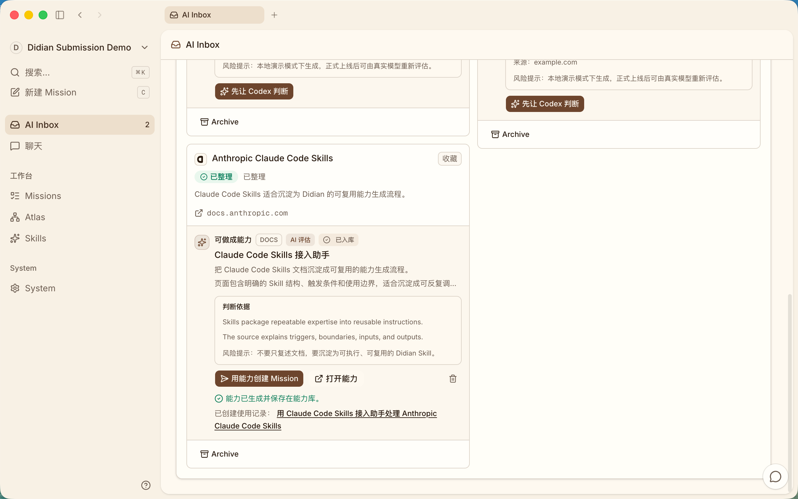

<div align="center">

# 🧩 Didian 资源工作台


**AI 资源工作台 — 从浏览器标签页到结构化、可搜索、去重的资源库。**

**[English](README.md) | 简体中文**

</div>

> Didian 在资料进入云盘前捕获浏览器中发现的标签页、链接、下载和收藏夹，派发给本地 AI Agent Runtime 执行，再整理成结构化、可追溯、可搜索的资源库 — 每一步写入都需人工确认。

<div align="center">
  
  <br><br>
  <a href="#-概念">概念</a> · <a href="#-功能特性">功能特性</a> · <a href="#-快速开始">快速开始</a> · <a href="#-技术栈">技术栈</a> · <a href="#-路线图">路线图</a>
</div>

---

## 💡 概念

Didian 不是给云盘加一个聊天框，而是完整的浏览器到云盘资源工作流：

1. **采集** — 浏览器扩展在上下文丢失前收集活跃标签页、链接、下载、收藏夹和搜索结果。
2. **分发** — AI Inbox 创建 Mission 并路由到本地 Agent Runtime（Codex、Claude Code、Cursor Agent 或 OpenCode）。
3. **执行** — 本地 daemon 检测可用的 CLI，在隔离工作目录中运行 Agent，并将进度（输入 → 理解 → 计划 → 执行日志 → 证据 → Review → 产物 → 记忆）实时流回工作台。
4. **审核** — 用户检查证据、建议操作和生成的产物，然后批准写入。MVP 禁止删除、覆盖、批量移动等破坏性操作。
5. **入库** — 批准的产物进入 Atlas Workspace：结构化、去重、可追问，并保留来源出处。

第一公里是浏览器，最后一公里是结构化的永久记忆。

---

## ✨ 功能特性

| 功能 | 说明 |
|------|------|
| **AI Inbox** | 采集浏览器标签页、链接和下载为资源任务，保留完整来源信息（URL、来源标签页、采集时间、上下文） |
| **Mission 工作区** | 动态任务图，展示扫描、提取、匹配、规划、确认、执行、入库等可检查的执行步骤 |
| **本地 Agent Runtime** | Daemon 自动检测 Codex、Claude Code、Cursor Agent、OpenCode — 无云端锁，数据不离机 |
| **Atlas 工作区** | 结构化、可搜索、去重的资源库，包含 Agent 生成的产物、证据和决策记录 |
| **人工确认闸门** | 写入云盘前检查每个建议操作；MVP 默认阻止破坏性操作 |
| **Adapter 云盘层** | `MockDriveAdapter` 用于 MVP 开发，提供清晰的本地文件夹、云盘、MCP 扩展接口 |
| **可追溯产物** | 资源索引、项目对比表、复用清单和下一步计划，带来源引用 |
| **浏览器扩展** | 被动采集当前浏览器上下文 — 标签页、选中文本、下载链接 |

---

## 🚀 快速开始

```bash
git clone https://github.com/didian-ai/didian.git
cd didian
pnpm install
cp .env.example .env
make setup
make start
```

验证整个技术栈正常运行：

```bash
pnpm typecheck
pnpm lint
pnpm test
make test
make check
```

<details>
<summary>⚙️ 环境变量</summary>

```bash
cp .env.example .env
```

| 变量 | 说明 | 必须 |
|------|------|------|
| `DATABASE_URL` | PostgreSQL 连接串 | 是 |
| `DIDIAN_CODEX_PATH` | Codex 二进制自定义路径 | 否 |
| `DIDIAN_CODEX_MODEL` | Daemon 级默认 Codex 模型 | 否 |

</details>

<details>
<summary>🔌 接入本机 Codex</summary>

Didian 会把 Mission 派发给本机 daemon，由 daemon 检测你机器上的 `codex` CLI，并在本机执行任务。

```bash
didian setup self-host
```

如果还没安装 CLI、正在仓库源码里开发：

```bash
cd server
go run ./cmd/didian setup self-host
```

`setup self-host` 会配置 `http://localhost:8080` 为 API、`http://localhost:3000` 为 Web，打开浏览器登录，发现 workspace，并启动 daemon。daemon 会从 `PATH` 自动检测 Codex；在 macOS 上也会检查 ChatGPT.app 和 Codex.app 内置的 Codex binary。

确认 Codex runtime 在线：

```bash
didian daemon status
didian runtime list --output json
```

在 runtime 输出里，Codex 记录应该是 `provider` 为 `codex`，`status` 为 `online`。Codex runtime 在线且 Agent 已绑定后，新建 Mission 就可以在 UI 里分配给这个 Agent。

**排障。** 如果 `daemon status` 只显示其他 agent，或者 `runtime list` 里 Codex runtime 是 `offline`，重启 daemon：

```bash
codex --version
didian daemon stop
didian daemon start
```

在 macOS 上，如果 Codex 打包在 ChatGPT.app 里但仍未被检测到，显式指定路径：

```bash
DIDIAN_CODEX_PATH=/Applications/ChatGPT.app/Contents/Resources/codex \
didian daemon start
```

</details>

---

## 🏗️ 技术栈

| 层 | 技术 |
|-----|------|
| 前端 | React 19、Next.js 16、TypeScript 5 |
| 样式 | Tailwind CSS 4、shadcn/ui、Base UI |
| 桌面 | Electron |
| 移动端 | Expo / React Native |
| 后端 | Go 1.26、Chi router、sqlc、gorilla/websocket |
| 数据库 | PostgreSQL |
| 状态管理 | TanStack Query 5、Zustand 5 |
| 图表 | Recharts 3 |
| 扩展 | Chrome Extension (MV3) |

<details>
<summary>📁 项目结构</summary>

```
didian/
├── apps/
│   ├── web/                   # Next.js App Router 平台
│   ├── extension/             # Chrome 扩展 — 被动浏览器采集
│   ├── desktop/               # Electron 桌面应用
│   └── mobile/                # Expo / React Native (iOS)
├── server/
│   ├── cmd/didian/            # CLI 入口
│   ├── internal/daemon/       # 本地 Runtime 执行生命周期
│   ├── internal/handler/      # Chi router API 处理器
│   └── migrations/            # 数据库迁移
├── packages/
│   ├── core/                  # 无界面逻辑、schemas、API client、hooks、stores
│   ├── ui/                    # 可复用 UI 原子组件 (shadcn/ui)
│   ├── views/                 # Web/桌面共享产品页面
│   └── adapters/              # 云盘 adapter 实现 (Mock、Local 等)
├── tasks/                     # 实施计划和任务清单
├── docs/                      # 产品需求、技术方案和评审
├── demo-screenshots/          # 演示截图
├── CLAUDE.md                  # 本地 Agent 工程规范
└── llms.txt                   # LLM 可发现的纯文本 README
```

</details>

---

## 🗺️ 路线图

- [x] AI Inbox — 采集浏览器标签页、链接和下载，保留来源信息
- [x] Mission 工作区 — 动态任务图，展示可检查的执行步骤
- [x] Atlas 工作区 — 结构化、可搜索、去重的资源库
- [x] 本地 Agent Runtime 检测 — Codex、Claude Code、Cursor Agent、OpenCode
- [x] Flowix 风格文档工作区 (Mission Detail)
- [x] Demo fixtures、截图和录制
- [x] Atlas 工作区浏览器和重新进入
- [ ] 浏览器扩展 — 被动采集当前上下文
- [ ] Atlas 集合全文搜索和召回
- [ ] 云盘 Adapter 集成 (Local Drive、官方云盘 API)
- [ ] 移动端配套应用
- [ ] 实时协作和多 Agent 小组

---

## 🤝 贡献

Fork → `feature/name` → PR

贡献前请阅读 `CLAUDE.md`。它是本仓库的根级工程规范，涵盖架构、包边界、状态管理和代码约定。

---

## 📄 许可证

Didian。使用 [修改版 Apache License 2.0](LICENSE) 授权。